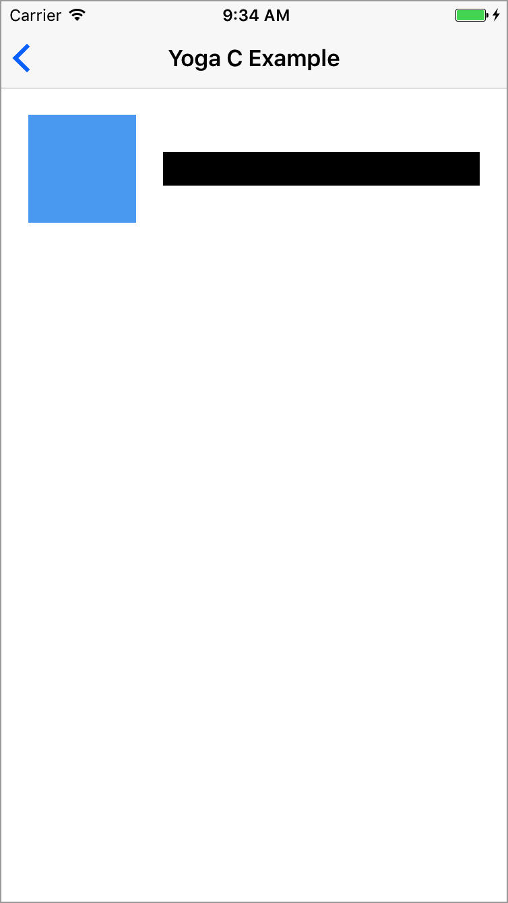
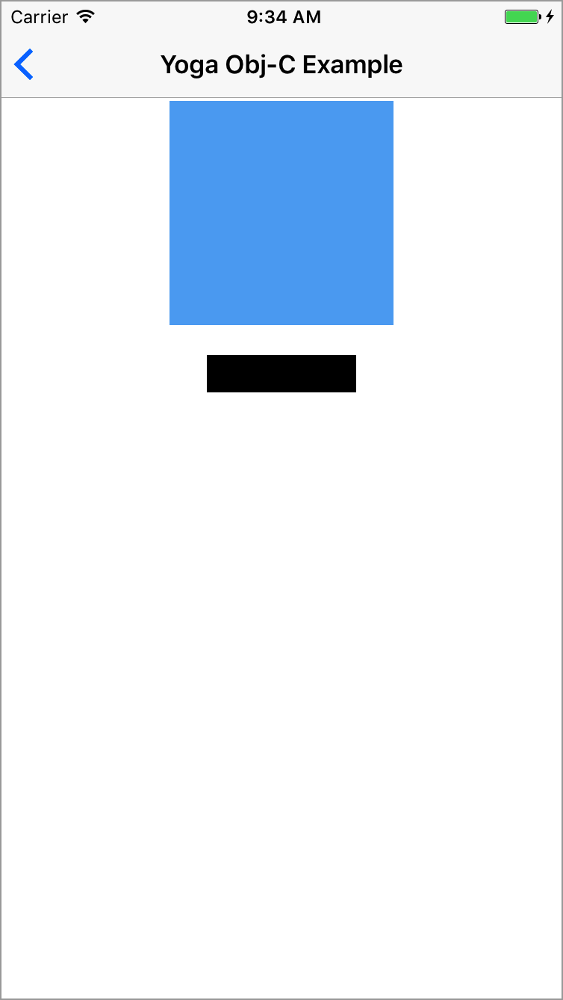
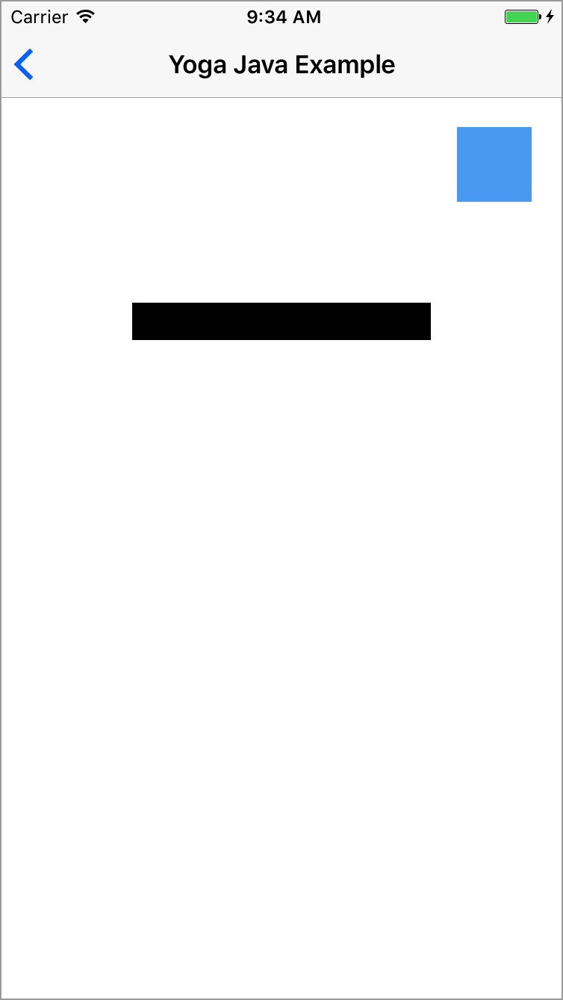
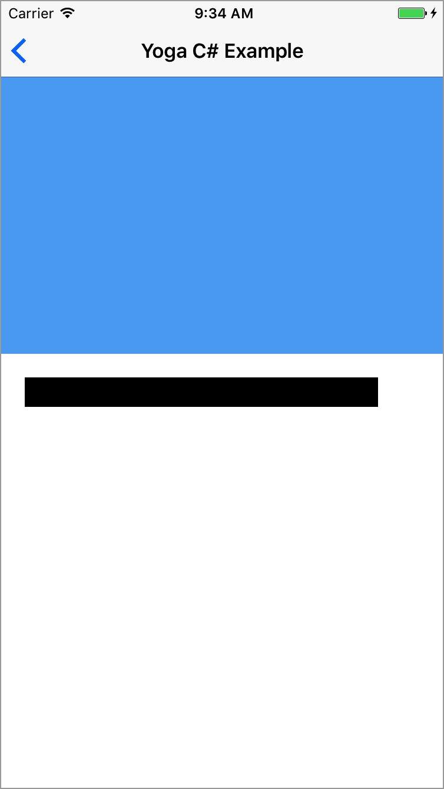
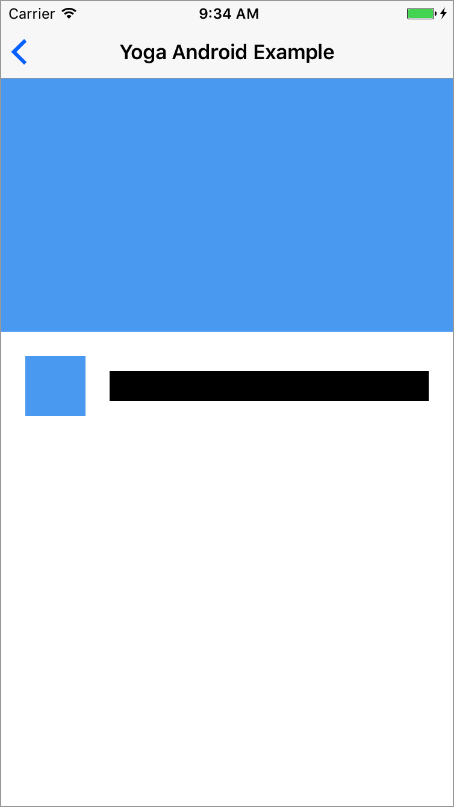

	

<h1 align="center" style="color: #376C9D; font-family: Arial Black, Gadget, sans-serif; font-size: 1.5em">FlexLayout Examples</h1>

The FlexLayout's Example exposes some usage example of FlexLayout.

The Example App is available in the [`Example`](https://github.com/layoutBox/FlexLayout/tree/master/Example) folder. 

### Running the Example app
1. Do a `pod install` from the FlexLayout root directory.
2. Open the newly generated `FlexLayout.xcworkspace` Xcode workspace.
3. Select the `FlexLayoutSample` target.
4. Run the app on your device or simulator.

 

## Intro Example
FlexLayout introduction example.  
[Source code](https://github.com/layoutBox/FlexLayout/blob/master/Example/FlexLayoutSample/UI/Examples/Intro/IntroView.swift)

  
## Ray Wenderlich Pilates Tutorial
An implementation of the [Ray Wenderlich Pilates Tutorial](https://www.raywenderlich.com/161413/pilates-tutorial-using-cross-platform-layout-engine). This example is the most complete one.  
[Source code](https://github.com/layoutBox/FlexLayout/blob/master/Example/FlexLayoutSample/UI/Examples/RaywenderlichTutorial)

## UITableView with variable size cells.
This example show how FlexLayout can be used to layout UITableView cells that have variables sizes.  
[Source code](https://github.com/layoutBox/FlexLayout/blob/master/Example/FlexLayoutSample/UI/Examples/TableViewExample)

## UICollectionView with variable size cells
This example show how FlexLayout can be used to layout UICollectionView cells that have variables sizes.  
[Source code](https://github.com/layoutBox/FlexLayout/blob/master/Example/FlexLayoutSample/UI/Examples/CollectionViewExample)

## Pilates's examples Implementation 

Implementation of all [Pilates's examples](https://facebook.github.io/pilates/)

|  C |  | [Source code](https://github.com/layoutBox/FlexLayout/blob/master/Example/FlexLayoutSample/UI/Examples/PilatesExampleA/PilatesExampleAView.swift) |
|---------|:-:|:-:|
|  Obj-C |  | [Source code](https://github.com/layoutBox/FlexLayout/blob/master/Example/FlexLayoutSample/UI/Examples/PilatesExampleB/PilatesExampleBView.swift) |
| Java |  | [Source code](https://github.com/layoutBox/FlexLayout/blob/master/Example/FlexLayoutSample/UI/Examples/PilatesExampleC/PilatesExampleCView.swift) |
|  C# |  | [Source code](https://github.com/layoutBox/FlexLayout/blob/master/Example/FlexLayoutSample/UI/Examples/PilatesExampleD/PilatesExampleDView.swift) |
|  Android |  | [Source code](https://github.com/layoutBox/FlexLayout/blob/master/Example/FlexLayoutSample/UI/Examples/PilatesExampleE/PilatesExampleEView.swift) |
